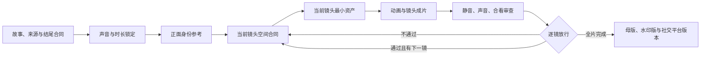

# 纸片动画导演

> 把故事逐镜做成真正“演起来”的纸片动画：身份稳定、空间可信、物件可认、动作有因果、声音不丢失。

`paper-animation-director` 是一套面向连续叙事纸片动画的导演与制作规程。它适用于剪纸动画、皮影动画、柔和工笔动画、宣纸水彩故事、文化与历史题材短片，尤其适合那些不能靠“几张漂亮图片 + 平移”糊过去的项目。

这里的“纸片”首先指分层与运动方法，不强制画面模拟厚纸、撕边或粗纤维。它可以呈现剪纸、宣纸、绢本、柔和工笔或其他经过锁定的表面风格。

它是一个**纯文件、跨工具、可项目化复用**的 Skill：核心由 Markdown 规程、参考文档、审计脚本和最小项目模板组成。其他工具可以读取和执行这套规则，但为了获得最完整、最连贯的制作效果，**本项目首选并推荐使用 Codex 应用**。

## 兼容哪些工具？

| 工具 | 建议等级 | 推荐接入方式 | 能力边界 |
| --- | --- | --- | --- |
| OpenAI Codex 应用 | **首选** | 安装到 Codex skills 目录，或放进当前工作区的 skill 目录 | 除最终语音合成外，建议用 Codex 完成剧本、研究、分镜、空间合同、素材生成、工程、动画、审片和交付 |
| Cursor | 兼容 | 放入项目 `.cursor/` 规则目录或工作区文档，并保留完整 `references/`、`scripts/` | 可以读取规程与执行脚本，但图像生成、浏览器审片和长流程上下文需要额外配置 |
| Claude Code 类工具 | 兼容 | 放入项目 `.claude/skills/`，或将 `SKILL.md` 加入项目说明 | 可以执行文本和工程工作，完整媒体制作能力取决于宿主环境 |
| 其他支持 Markdown 规则的工具 | 基础兼容 | 把 `SKILL.md` 作为主规则，把 `references/` 作为按需参考 | 只能保证规则可读，不能保证具备素材生成、动画预览和成片验证能力 |

这里的“兼容”指文件和工作流兼容，不代表所有工具都能完整执行同一条媒体生产链。若目标是减少跨平台搬运、上下文丢失和审片证据断裂，优先使用 Codex 应用。

## 为什么首选 Codex？

Codex 应用可以在同一个任务中统一使用推理、文件编辑、终端、技能、图像生成和浏览器检查。对纸片动画而言，这种连续性很重要：剧本中的一个动作目标，可以继续进入分镜、空间合同、图像提示、素材文件、时间轴代码、渲染帧和放行记录，而不需要在多个聊天工具之间反复解释。

在本 Skill 的完整工作流中，建议把 Codex 当作总导演、编剧、分镜师、素材制作协调器、动画工程师和审片执行者：

| 制作阶段 | 推荐使用的 Codex 能力 | 主要产物 |
| --- | --- | --- |
| 选题、改编与剧本 | 长文本推理、文件读写、资料整理 | 故事合同、来源边界、事件链、结尾论点 |
| 分镜与空间规划 | 推理、结构化清单、图表和本地文件 | 分镜表、俯视平面、正视机位、运动走廊、动作目标 |
| 角色与美术设计 | 内置图像生成和图像编辑技能 | 正面身份参考、镜头专用完整姿势、背景、道具、整场景状态 |
| 素材整理 | 文件、终端和项目脚本 | 透明素材、姿势拆分、命名清单、完整性审计结果 |
| 动画工程 | 文件编辑、终端、HyperFrames 项目和本地预览 | 确定性时间轴、动作边车、镜头工程和渲染成片 |
| 视觉审片 | 应用内浏览器、截图、成片抽帧和图像检查 | 联系表、头脸检查、支撑面检查、语义证明帧 |
| 声音后期 | 文件、终端、音视频探测和混音脚本 | 声音账本、字幕、混音、响度与预期台词检查 |
| 最终交付 | 本地脚本、完整解码、画质比较和版本管理 | 无水印母版、水印母版、社交平台版本和交付报告 |

默认不要把剧本、分镜、角色设计、背景、道具或镜头动画转交给另一个通用生成平台。只有当用户明确指定其他工具，或当前 Codex 环境确实缺少某项能力时，才补充外部工具，并在项目记录中说明原因。

语音合成是建议保留的外部例外：可以使用 Fish Audio 或豆包生成旁白和角色对白，但声音选角、试听脚本、批量调用、文件归档、时长探测、混音、字幕和审片仍由 Codex 统一管理。

以上推荐针对本 Skill 的流程完整度，不是对所有产品场景的通用排行榜。实际可用能力取决于 Codex 版本、账户权限、已安装技能、本机工具和工作区授权。可参考 [Codex 应用官方介绍](https://openai.com/index/introducing-the-codex-app/) 与 [Codex 扩展工作流说明](https://openai.com/index/codex-for-almost-everything/)。

## 目录

- [兼容哪些工具](#兼容哪些工具)
- [为什么首选 Codex](#为什么首选-codex)
- [核心流程](#核心流程)
- [十步逐镜生产闭环](#十步逐镜生产闭环)
- [安装与快速开始](#快速开始)
- [逐镜放行](#逐镜放行当前镜头通过才开始下一镜)
- [表面风格合同](#表面风格合同纸片是方法不是固定材质)
- [资产架构](#资产架构什么时候整合什么时候分层)
- [角色一致性](#角色一致性最低标准)
- [关键物件与支撑面](#关键物件与支撑面)
- [历史题材空间准则](#历史题材的空间准则)
- [语音合成服务建议](#语音合成服务建议fish-audio-或豆包)
- [声音、字幕与恢复](#声音字幕和恢复)
- [三次审片](#三次审片)
- [目录导航](#目录导航)
- [版本记录](#版本记录)
- [作为开源项目使用](#作为开源项目使用)
- [安全与隐私](#安全与隐私)
- [许可证](#许可证)


> 如果上面的流程图在当前查看器中不可见，可直接看下方的 Mermaid 版本。



## 这套 skill 解决什么问题？

它专门解决纸片动画中最容易被忽略、但最影响观感的事情：

| 问题 | 导演规则 |
| --- | --- |
| 人物像贴纸，走路像顺移 | 完整人物多帧 + 规范化六帧步态 |
| 床、桌、灯、人物互相悬浮 | 先画空间平面；接触脆弱时整场景生成 |
| 角色每个镜头长得不一样 | 唯一正面身份参考 + 镜头专用完整姿势 |
| 人物走错方向、目标够不到 | 运动走廊 + 朝向 + 动作目标 + 可达性合同 |
| 画框、蒙版或前景切掉半张脸 | 头脸保护区 + 计划遮挡申报 + 身份确认帧 |
| 揭榜、扶起、拦驾、拉被看不懂 | `cause → action → propagation → result → proof` |
| 箭、文书、草、金银像抽象图标 | 现实类别 + 轮廓 + 比例 + 材质 + 状态证明 |
| 人、马、车轮或道具悬空 | 为每个主体声明地面、道路、车板或其他支撑面 |
| 历史宫殿像影视城或破旧木屋 | 史料采用清单 + 后世元素排除清单 |
| 旁白说了，画面没做 | 每个动词必须有静音可读的证明帧 |
| 皇帝声音像普通人、甚至带方言 | 试听同时检查口音、身份、咬字和情绪 |
| 成片有音轨却丢了旁白 | 声音账本 + 原始干声 + 预期台词逐条核验 |
| 字幕遮住手、脚、灯和接触点 | 默认底部水平居中，按实际渲染帧检查安全区 |
| 预览和成片不一致 | 最终以渲染成片抽帧和音视频探测为证据 |

## 核心流程

```text
故事与来源成立
  → 声音和时长锁定
  → 身份参考批准
  → 当前镜头空间成立
  → 当前镜头资产适配
  → 动作可读
  → 声音归属
  → 字幕安全
  → 镜头放行
  → 下一镜
  → 全片交付
```

不要反过来。灯光、纸纹、粒子和漂亮转场不能修复错误的朝向、悬空的人物、不可辨认的关键物件或丢失的台词。

## 十步逐镜生产闭环

1. **项目合同**：锁定选题、平台、画幅、来源边界、前三秒吸引点和结尾论点。
2. **故事合同**：把叙述写成原因、动作、传播、结果和证明帧，不让旁白独自承担事件。
3. **声音合同**：完成角色试音、口音筛选、说话人归属、声音账本和实测时长。
4. **身份合同**：每个重复角色只批准一张正面中性身份参考，禁止把它直接放进动画。
5. **镜头合同**：为当前镜头批准俯视平面、正视机位、运动走廊、障碍、方向、目标、保护区和遮挡。
6. **资产合同**：只生成当前镜头所需的最少资产；错误方向、比例、接触或语义必须重新生成。
7. **基准合同**：先用最难的 8–15 秒证明身份、接触、物理、方向、因果、声音和字幕。
8. **成片审查**：只从渲染成片抽帧，完成静音、只听声音、画音合看、现实合理性和技术检查。
9. **逐镜放行**：当前镜头的放行记录严格通过后才开始下一镜；其余镜头重复第 5 至第 9 步。
10. **全片交付**：分别保存无水印母版、水印母版和社交平台版本，完成完整解码、画面复核和质量门槛检查。

## 快速开始

### 0. 安装 / 复制 skill

#### 方式 A：Codex 一站式制作（首选）

将整个 `paper-animation-director/` 文件夹复制到 Codex 的 skills 目录，保持以下结构：

```text
<codex-skills>/paper-animation-director/
├── SKILL.md
├── README.md
├── references/
├── scripts/
└── assets/
```

在 Codex 中直接调用：

```text
使用 $paper-animation-director 把这段故事制作成柔和工笔纸片动画。
先锁定故事、声音和正面身份参考，再逐镜完成空间合同、最小资产、成片审查与放行；
当前镜头未通过，不开始下一镜。
```

建议在同一个 Codex 项目和任务链中持续完成：

```text
故事改编
→ 资料与来源核对
→ 分镜和空间合同
→ 正面身份参考
→ 镜头素材生成
→ HyperFrames 动画工程
→ 渲染与抽帧审查
→ 放行和最终交付
```

其中只有“把已批准文本真正合成为人声”建议调用 Fish Audio 或豆包；合成前后的所有工作仍由 Codex 执行。

#### 方式 B：Cursor 项目内接入

将本目录复制到项目中，例如：

```text
your-video-project/
├── .cursor/
│   └── rules/
│       └── paper-animation-director.md
└── tools/
    └── paper-animation-director/
        ├── SKILL.md
        ├── references/
        └── scripts/
```

在 `.cursor/rules/paper-animation-director.md` 中写明：

```md
当任务涉及纸片动画、皮影动画、连续角色或历史/非遗场景时，
先阅读 tools/paper-animation-director/SKILL.md，
再按制作阶段阅读其 references/ 文件。不得跳过空间平面、完整姿势、静音 proof 和渲染抽帧审查。
```

在 Cursor Agent/Composer 中可以这样开始：

```text
@paper-animation-director
请把这段剧本转换为横版纸片动画方案。先输出故事合同、声音计划和角色正面身份参考要求，
然后只规划最难镜头的空间合同，不要批量生成素材。
```

#### 方式 C：Claude Code 类工具

如果工具支持项目级 skills，将目录放在：

```text
your-project/.claude/skills/paper-animation-director/
```

至少保留 `SKILL.md`、`references/` 和 `scripts/`。在项目 instructions 中加入：

```md
纸片动画任务必须先读取 .claude/skills/paper-animation-director/SKILL.md。
历史、非遗、重复角色或复杂空间任务还必须读取 references/production-retrospective.md。
```

然后用自然语言调用：

```text
读取 .claude/skills/paper-animation-director/SKILL.md 并用于本项目。
先做故事事件链、来源采用/排除清单、声音锁定和正面身份参考，
再为 8–15 秒基准镜头建立空间合同；不得提前批量生成其他镜头素材。
```

#### 方式 D：任何支持 Markdown 规则的工具

不需要特殊插件。把 `SKILL.md` 当作主规则文件，把 reference 按需加载：

```text
1. 读取 SKILL.md
2. 读取 production-retrospective.md
3. 读取当前阶段需要的 reference
4. 执行 scripts/ 中的审计命令
5. 在渲染 MP4 抽帧后再交付
```

### 运行环境要求

| 能力 | 用途 | 必需性 |
| --- | --- | --- |
| Codex 应用 | 统一完成剧本、研究、分镜、图像素材、工程、审片和交付 | **首选制作环境** |
| Python 3 | 故事清单、素材、节奏与声音审计脚本 | 必需 |
| Node.js / npm | HyperFrames 工程与渲染命令 | 使用 HyperFrames 时必需 |
| FFmpeg / FFprobe | 音视频探测、社交平台版本与成片核验 | 交付时必需 |
| Codex 内置图像生成与编辑 | 正面身份参考、镜头专用背景、完整角色、道具和整场景帧 | 生成新素材时必需 |
| Fish Audio 或豆包 | 最终旁白和角色对白合成 | 有配音时必需 |
| Codex 应用内浏览器或本地预览 | 动画预览、截图、交互检查和审片 | 开发阶段推荐 |

外部语音服务的密钥只放在环境变量或外部 `.env`，不要写入 Skill、项目清单、README、提示词或音频候选记录。Codex 负责调用和管理这些文件，但不应把密钥复制进文档、日志或提交记录。

### 1. 读路由与复盘规程

主规则在 [`SKILL.md`](SKILL.md)，通用项目复盘和失败模式在 [`references/production-retrospective.md`](references/production-retrospective.md)。

- 历史、文化、空间复杂或角色重复的项目，两者都要读。
- 柔和工笔、寓言或社交平台叙事还要读 [`references/gongbi-fable-production-retrospective.md`](references/gongbi-fable-production-retrospective.md)。
- 进入任何具体镜头前要读 [`references/shot-spatial-contract.md`](references/shot-spatial-contract.md)。

### 2. 建立故事清单

```bash
cp assets/project-template/manifests/story-manifest.example.json ./story-manifest.json
python3 scripts/validate_story_manifest.py story-manifest.json --strict
```

示例清单是当前验证器的标准入口。除叙事目标、事件链和活动时间窗外，还要填写平台、画幅、结尾合同、角色身份、镜头空间、方向、动作目标、保护区域、计划遮挡和镜头资产门禁。不要用一份手写的简化字段表替代示例。

### 3. 锁定声音与正面身份参考

```bash
python3 scripts/probe_voice_timing.py assets/audio/*.mp3 --output voice-manifest.json
```

为每个角色保留声音候选、公开来源、试听文本、口音与咬字判断、选中理由和淘汰理由。为每句声音建立账本，记录稳定编号、说话人、原文、源文件、开始时间、实测时长、增益、必需性和修订号；原始干声不得被最终混音覆盖。

每个重复角色只批准一张正面中性、最好是完整身体的身份参考。它仅用于后续生成的一致性条件，必须标记为“仅身份参考、禁止动画使用”。此时不要生成侧面图、步态、表情、动作姿势、背景、道具或特效。

### 4. 规划并生成当前镜头

先在故事清单中完成当前镜头的语义事件和空间合同，证明：

- 起点、终点、运动走廊、障碍和净空成立；
- 移动方向、身体朝向、视线、入画和出画一致；
- 动作目标真实存在、语义正确、可到达且能在证明帧中看清；
- 背景为运动、头脸保护、关键物件和字幕保留安全区；
- 每个计划遮挡都声明遮挡物、深度、时间窗、原因和无遮挡身份确认帧。

空间合同批准后，只生成当前镜头所需的最少资产，再做素材审计：

```bash
python3 scripts/audit_asset_integrity.py assets/generated --kind character --strict
```

错误方向、比例、机位、接触、光向、裁切或语义的资产必须重新生成。已有素材只是候选，不构成复用理由。

### 5. 先做基准镜头并建立工程

基准镜头应包含项目最难的动作：共同负重、扶起、拦驾、命令响应、灯—幕—影光学关系、火水传播或完整工艺步骤。先用 8–15 秒证明身份、头脸完整性、接触、比例、方向、因果、声音和字幕。

```bash
python3 scripts/init_paper_project.py --manifest story-manifest.json --output ./my-paper-story
python3 scripts/build_hyperframes_timeline.py --manifest story-manifest.json --project ./my-paper-story
npm --prefix ./my-paper-story run check
```

每个场景使用一个可暂停、可寻址的时间轴；所有音频直接挂在根组合；关键动作写入 `*.motion.json`，不能只让装饰粒子“动起来”。

### 6. 从镜头成片审查并放行

审查证据必须来自实际渲染的镜头视频，不得用编辑器截图代替：

```bash
python3 scripts/make_review_contact_sheet.py \
  --video shots/scene-01/rendered.mp4 \
  --times 0,1.2,2.4,3.6,4.75 \
  --output shots/scene-01/review-contact-sheet.png

python3 scripts/audit_shot_release.py shots/scene-01/shot-release.json --strict
```

上面的抽帧时间只是写法示例，必须替换成当前镜头真实的首帧、中间帧、接触帧、证明帧、尾帧和遮挡边界时间。审查全片时，也可以改用 `--manifest story-manifest.json` 自动收集各镜头的审查时间。

放行记录可以从 [`assets/project-template/manifests/shot-release.example.json`](assets/project-template/manifests/shot-release.example.json) 复制。填写真实视频、审查帧、关键物件、预期台词和检查结果后再运行严格审计；不要直接对示例文件做路径检查。

基准镜头通过后，其余镜头仍然逐镜重复“空间合同 → 最小资产 → 动画 → 镜头成片 → 三次审片 → 放行”。当前镜头未通过，不开始下一镜。

### 7. 完成全片与交付版本

在全片完成后检查节奏、声音、字幕、动态水印和技术交付：

```bash
python3 scripts/audit_pacing.py story-manifest.json \
  --voice-manifest voice-manifest.json \
  --strict

python3 scripts/encode_social_delivery.py \
  master.mp4 \
  social-1080p.mp4 \
  --vmaf-floor 95
```

分别保留无水印母版、水印母版和压缩后的社交平台版本。社交平台版本必须完成完整解码、音视频探测、实际帧复核和质量门槛检查，不得覆盖母版。

## 逐镜放行：当前镜头通过才开始下一镜

逐镜放行不是“看起来不错”的口头确认，而是一份可审计的镜头记录。每份记录至少要包含：

- 稳定的镜头编号和真实渲染视频路径；
- 首帧、中间帧、证明帧和尾帧；接触镜头还要有接触帧；
- 静音语义、必需名词、物件现实感、地面支撑、身份连续性检查；
- 只听声音、画音字幕合看、字幕安全和预期台词可听性检查；
- 关键物件的类别、轮廓、比例参照、材质、支撑或依附、状态序列和禁止替代物；
- 技术解码、渲染成片抽帧和审片结论；
- 已知限制、返修说明和最终决定。

严格审计失败时，下一镜保持锁定。修复目标应指向实际根因：空间错误回到空间合同，素材错误重新生成，动作或声音错误回到时间轴；不要靠裁切、遮挡、镜像、加速或解释性字幕掩盖问题。

## 表面风格合同：纸片是方法，不是固定材质

项目开始时要锁定表面风格，并把采用项和排除项写进项目合同。

柔和工笔、绢本或克制手绘设色通常应采用：

- 细而稳定的轮廓；
- 柔和渐变、克制高光和统一色温；
- 清楚但不过度立体的层级；
- 与叙事时代、地域和情绪一致的纹理密度。

当用户没有要求明显纸艺表面时，应排除：

- 粗重纸纤维和纸浆颗粒；
- 撕裂白边、卷曲边缘和纸板厚度；
- 浮雕、压纹或手工拼贴阴影；
- 为了“像纸”而覆盖人物五官、服饰纹样或关键物件的噪声。

分层、遮挡、枢轴和确定性运动仍然构成纸片动画；表面是否像纸，应服从用户的美术方向。

## 资产架构：什么时候整合，什么时候分层？

### 默认整合

- 床 + 李夫人 + 锦被 + 帐架；
- 灯体 + 油盘 + 灯芯 + 火焰；
- 扶起、拦驾、抬物、拥抱、共同负重；
- 需要同时证明空间接触和人物状态的关键帧。

### 允许独立

- 需要走动、转向、反应的完整人物；
- 需要独立传播的帐纱、烟、火光、纸纹；
- 灯、幕、影人之间的光学关系；
- 不承载人物语义、只承担物理效果的道具。

“独立”指独立的完整 PNG，不指把头、身体、手、腿拆成零件。人体零件拼接不是纸片动画的默认方案。

## 角色一致性最低标准

每个重复角色必须先批准且只批准一张正面中性身份参考图，并记录：

- 脸型、年龄、眉眼和发式；
- 帽冠、服装轮廓、腰带、鞋和主色；
- 身体比例、稳定识别特征和禁用变化；
- 项目表面风格、主光方向和色彩边界。

身份参考图只用于后续图像生成的一致性条件，不得抠出、动画化、放进时间轴或交付成片。侧面、背面、表情、动作姿势和步态必须在当前镜头空间合同批准后，根据机位、方向、动作目标和接触关系按镜头生成。

需要走路时，当前镜头至少使用六帧完整身体步态：

```text
承重 → 抬脚 → 落脚 → 过渡 → 换脚 → 收势
```

所有帧必须具有同一朝向、画布、脚底线和人物中心。父轨道负责世界坐标移动，子帧负责重心变化；只做水平平移不算走路。步态方向与镜头移动方向不一致时应重新生成，不得默认镜像或强行复用。

## 关键物件与支撑面

每个被旁白点名、推动因果或承担文化含义的物件，都要先建立“可辨认合同”：

- **现实类别**：它在真实世界中是什么；
- **轮廓结构**：观众静音观看时凭什么认出它；
- **比例参照**：与手、身体、马、车、门窗或容器相比有多大；
- **材质线索**：厚度、边缘、纹理、反光、重量和受力方式；
- **支撑或依附**：由哪只手握住、立在哪块地面、挂在哪面墙、扎根在哪里；
- **状态序列**：动作前、动作中和动作后的可见变化；
- **证明时间**：在哪一帧能确认它确实完成了叙述中的作用；
- **禁止替代**：不能退化成哪些抽象线条、图标、色块或占位符。

生成模型不应即兴绘制重要文书、告示、地图、钱币或文字。需要文字时，先生成史实可信的空白载体，再用确定性排版加入经过核验的内容。

每个站立的人物、动物、车轮、车辆和放置道具都必须绑定明确支撑面。首帧、中间帧、动作证明帧和尾帧都要检查脚、蹄、车轮、接触阴影、遮挡和尺度，防止角色漂浮、站到马背上方或脱离道路。

命令必须表现为状态转变。例如“放下武器”至少要呈现：

```text
武器举起或瞄准 → 命令或手势 → 武器明显放下 → 安全结束状态
```

## 历史题材的空间准则

以汉代宫廷为例，庄重感应来自：

- 高台、夯土基座、柱网、开间和台阶；
- 维护良好的髹漆木构和墙面；
- 低榻、席地、低案、帷帐和真实落点；
- 大尺度、密缝、哑光的方砖/条砖，而不是现代抛光瓷砖；
- 厅堂、殿庭和临时棚架，而不是后世成熟固定戏台。

每个历史选择都要同时写：

```text
采用：证据支持的结构/材质/活动
排除：不属于时代或会破坏空间的元素
```

## 语音合成服务建议：Fish Audio 或豆包

Codex 负责声音工作的全部决策和后期，只把最终的“文本转人声”交给外部语音服务。不要把剧本改写、角色理解、台词拆分、时间轴、混音或字幕也外包给语音平台。

### 什么时候优先使用 Fish Audio

Fish Audio 更适合需要明显角色差异、细腻情绪、角色化表演或多说话人对白的镜头。建议：

- 每个角色用同一段代表性台词试听 3–5 个候选；
- 同时检查普通话、句尾、停顿、情绪、年龄感和角色身份；
- 记录公开模型名称、模型编号、公开页面、试听文本和选择理由；
- 只使用来源清楚、授权范围明确的公开音色或自有授权声音；
- 不使用明星模仿、来源不明的私人复刻或无法确认商用范围的声音；
- 以官方当前推荐模型为准，不在 Skill 中永久写死容易过期的模型版本。

Fish Audio 的接口支持通过声音模型编号生成单人语音，也支持多说话人合成和语速、音量等韵律控制。接入时参考 [Fish Audio 文字转语音接口](https://docs.fish.audio/api-reference/endpoint/openapi-v1/text-to-speech) 与 [Fish Audio 模型说明](https://docs.fish.audio/developer-guide/models-pricing/models-overview)。

### 什么时候优先使用豆包

豆包更适合中文长旁白、稳定批量生产、明确语速控制、发音修正和需要多种中文音色的项目。建议：

- 用包含历史人名、地名、多音字、数字、长句和情绪转折的段落试听；
- 优先检查长段落的一致性、断句、气口和句尾，不只试听一句短句；
- 记录音色编号、服务版本、语速、音高、情绪、输出格式和修订号；
- 需要精确停顿或发音时，优先使用服务支持的文本标记或发音控制；
- 使用声音复刻时必须拥有被复刻者的明确授权，并保留授权边界记录。

豆包语音提供多音色、语速、音高、情感和长文本合成能力。接入时参考 [豆包语音产品简介](https://www.volcengine.com/docs/6561/79817?lang=zh) 与 [豆包语音合成大模型说明](https://www.volcengine.com/docs/6561/1257543?lang=zh)。

### 两种服务都要遵守的选角规则

1. 同一角色跨镜头保持同一服务、同一音色和同一核心参数，不要在中途无记录切换。
2. 候选声音必须朗读同一段测试文本，先比较原始干声，再做均衡、混响或背景音乐。
3. 默认使用自然语速；画面时间不足时优先调整镜头动作，不通过极端加速压缩表演。
4. 每句台词单独保存高质量干声，文件名包含镜头、说话人和稳定台词编号。
5. 优先保存无损或高质量源文件，压缩格式只作为预览和派生版本。
6. Codex 在合成后立即探测时长、响度、静音和文件完整性，并写回声音账本。
7. 最终混音前完成只听声音审查；最终编码后再核对预期台词，不能只检查是否存在音轨。

简单选择建议：

| 需求 | 优先建议 |
| --- | --- |
| 多角色、强情绪、角色化对白 | Fish Audio |
| 中文长旁白、稳定批量合成 | 豆包 |
| 历史人名、多音字、精确停顿 | 两者同段试听，优先选择发音控制更稳定的一方 |
| 同时有旁白和多名角色 | 可以按角色选择服务，但同一角色不得跨服务漂移 |
| 商业发布 | 优先选择授权和商用边界最清楚的音色，而不是只追求“像某位名人” |

## 声音、字幕和恢复

1. 每句台词必须有唯一说话人；旁白不能代替角色念第一人称句。
2. 试听必须检查口音。“深沉、权威、电影感”不等于标准普通话。
3. 每句声音必须进入声音账本，并保留原始干声、公开来源和试听结论。
4. 中文字幕默认底部水平居中，不能盖住头脸、手脚、关键物件、影子边缘和接触点。
5. 最终编码前必须把预期台词与成片逐条核对；存在音轨不代表旁白真实存在。

声音审核要单独做一次“只听声音”：确认没有抢词、重叠、错角色、方言和不合情绪的语速。画面对不上时，先扩展动作或场景时间，不要强行压缩人物情感。

如果收到的视频保留了画面时长和音乐却丢失旁白，应使用已批准的声音账本与原始干声，在不改变画面时长和场景边界的前提下恢复原时间轴。不要重新选择声音、重新表演或通过变速硬塞台词。恢复后重新执行只听声音、画音合看、字幕同步、响度、完整解码和预期台词检查。

## 三次审片

### 静音看

能否看出谁在什么位置，为什么开始动，碰到了什么，结果改变了什么？

### 只听声音

每句是谁说的？音色、口音、语气是否符合人物？有没有旁白和对白重叠？

### 画音合看

字幕是否在说话时出现？动作是否先于/同步于台词？转场是否说明时间、地点或情绪改变？

三次审片之外，还要放大检查渲染成片中的头部和脸部区域。自然侧脸应保留连贯的头骨与面部轮廓；画框、容器裁切、蒙版、透明通道、前景或转场造成的直线断面属于失败。只有声明了可见遮挡物、深度、时间窗、叙事原因和无遮挡身份确认帧的遮挡，才可以放行。

## 目录导航

```text
paper-animation-director/
├── SKILL.md                         # 给模型执行的主规程
├── README.md                        # 人类快速阅读的导演手册
├── references/
│   ├── production-retrospective.md  # 全面复盘、失败模式与镜头卡模板
│   ├── gongbi-fable-production-retrospective.md # 柔和工笔寓言生产与返修复盘
│   ├── shot-spatial-contract.md     # 坐标、走廊、方向、目标、支撑与遮挡合同
│   ├── story-and-beat-design.md     # 故事与事件链
│   ├── character-and-pose-system.md # 身份、完整姿势、步态和组合动作
│   ├── image-generation-prompts.md  # 背景、角色和道具生成合同
│   ├── layers-physics-and-occlusion.md # 分层、物理、保护区与遮挡
│   ├── semantic-action-checks.md    # 动作、物件、支撑和命令状态
│   ├── voice-timing-and-subtitles.md # 试听、声音账本、字幕与旁白恢复
│   ├── hyperframes-production.md    # 确定性时间轴与工程要求
│   └── quality-gates-and-delivery.md # 审片、母版与社交平台交付
├── scripts/
│   ├── validate_story_manifest.py   # 验证故事、身份与镜头空间合同
│   ├── audit_shot_release.py        # 严格执行逐镜放行和下一镜锁定
│   ├── make_review_contact_sheet.py # 从镜头成片抽取审查联系表
│   ├── probe_voice_timing.py        # 探测声音时长、响度与静音
│   ├── audit_pacing.py              # 审计节奏、空白和活动覆盖
│   ├── audit_asset_integrity.py     # 检查素材裁切、透明度和边缘
│   └── encode_social_delivery.py    # 生成并检查社交平台版本
└── assets/project-template/
    ├── manifests/
    │   ├── story-manifest.example.json # 完整故事清单示例
    │   └── shot-release.example.json   # 逐镜放行记录示例
    └── README-flow.svg              # README 核心流程图
```

## 适用与不适用

适用：连续故事、重复角色、柔和工笔、纸影或剪纸、历史与文化题材、可验证动作、旁白驱动的分层动画项目。

不适用：主要由海报式信息卡组成的编辑型解释视频；这类项目应考虑 `vox-director` 或 `faceless-explainer`。

## 版本记录

### v2.4 · Codex 一站式制作与语音外接建议 · 2026-07-30

- 将 Codex 应用设为本 Skill 的首选制作环境；
- 建议剧本、研究、分镜、空间规划、视觉素材、动画工程、审片和交付统一由 Codex 完成；
- 明确语音合成是建议保留的外部例外，其他环节默认不转交通用生成平台；
- 增加 Codex 制作阶段与内置能力职责表；
- 增加 Fish Audio 与豆包的适用场景、试听方法、授权边界和选型建议；
- 要求外部语音合成后的时长探测、声音账本、混音、字幕和成片核验继续由 Codex 管理。

### v2.3 · 柔和工笔复盘与逐镜放行 · 2026-07-30

- 加入《九色鹿》完整制作、首版失败、逐镜返修、旁白恢复和压缩交付复盘；
- 明确纸片动画是分层与运动方法，不强制使用粗纤维、撕纸白边或纸板厚度；
- 加入关键物件的现实类别、轮廓、比例、材质、支撑、状态序列和证明时间；
- 加入人物、动物、车辆、车轮和放置道具的地面与支撑面连续性；
- 加入命令和集体响应的可见状态转变；
- 加入声音账本、原始干声保存、预期台词核验和旁白恢复规则；
- 加入逐镜放行记录模板与严格审计脚本，当前镜头未通过时锁定下一镜；
- 分离无水印母版、水印母版和社交平台版本，并要求完整解码、实际帧复核和质量门槛。

### v2.2 · 头脸完整性与遮挡审核 · 2026-07-29

- 将头部、脸部、手、脚和关键接触点加入每镜保护区域；
- 拦截画框、容器、overflow、蒙版、alpha 裁切、前景、字幕、转场或水印造成的半脸/断头效果；
- 区分自然侧脸、具有物理依据的计划遮挡与无来源的错误截断；
- 要求计划遮挡声明遮挡物、深度、时间窗、原因和无遮挡身份确认帧；
- 审片联系表自动加入遮挡进入、最大覆盖、退出和身份确认时刻。

### v2.1 · 角色参考与镜头空间合同 · 2026-07-29

- 将角色前置资产收敛为每个重复角色一张正面中性身份参考图，并明确禁止直接用于动画；
- 删除全局预生成姿势库，改为镜头空间合同通过后按镜头即时设计和生成；
- 加入归一化坐标、运动走廊、障碍、方向、朝向、动作目标、可达性和连续性合同；
- 将方向相反、通路不足、目标语义错误设为硬失败，禁止因素材已生成而强行复用；
- 更新 manifest 和验证器，使身份、空间与镜头资产门禁可自动检查。

### v2.0 · 制作复盘升级 · 2026-07-26

- 加入空间圣经和历史采用/排除双清单；
- 加入整场景多帧、灯火一体、ensemble 优先的资产决策；
- 加入六帧规范化步态和侧面视角规则；
- 加入标准普通话/口音排除、speaker 归属和字幕居中安全区；
- 加入静音/只听/画音三次审片；
- 加入预览缓存、渲染抽帧和交付证据规则；
- 加入本项目中的失败模式速查表与可复用镜头卡模板。

### v1.0 · 基础规程

建立完整角色、ensemble 动作、事件 proof、HyperFrames 时间轴和 P0–P3 交付门。

## 作为开源项目使用

### 项目级 vendoring

如果一个视频项目需要长期复用这套规则，建议把 skill 复制进项目的 `tools/`、`.cursor/` 或 `.claude/skills/`，并在项目自己的 `AGENTS.md`、`CLAUDE.md` 或 rules 文件中声明加载顺序。这样项目可以锁定一版稳定规程，不会因为全局 skill 更新而突然改变已审批的制作标准。

### 更新策略

- 只读 `SKILL.md` 不足以完成复杂项目；按阶段加载对应的 `references/`；
- 新的失败模式优先写进 `production-retrospective.md`，确认可迁移后再提升到 `SKILL.md` 的硬规则；
- 工具特定命令放在适配层或项目文档，不要把 Codex、Cursor、Claude Code 的私有 API 写进核心规则；
- 修改脚本后，用一个最小 manifest 和一个短 benchmark 做回归，不要只检查 Markdown 能否打开；
- 修改 README、SKILL 或 references 后，检查相对链接、示例路径和命令是否仍然成立。

### 贡献一个新经验

提交新规则时请说明：

```text
症状：观众/审片者看到了什么问题？
根因：是空间、素材、动作、声音、字幕还是工具链问题？
修正：采取了什么可复现的做法？
验证：通过哪一帧、哪条命令或哪种审片确认？
迁移：这条经验适用于哪些其他故事？
```

不要只提交“这一帧更好看”的主观结论，要提交能被另一个项目复用的判断标准。

## 安全与隐私

- 不要在仓库中提交 API key、访问令牌、`.env`、私有音频链接或未授权素材；
- 生成脚本只记录公开 voice/reference ID、参数和文件路径，不记录秘密；
- 历史图片、角色参考和音乐/音效应记录来源与使用边界；
- 需要公开仓库时，清理项目中的临时截图、缓存、预览 URL 和本地绝对路径；
- 最终交付中的动态水印不能替代版权、授权和素材来源记录。

## 许可证

本目录目前未附带正式开源许可证。若要发布到公共仓库，请由项目维护者补充 `LICENSE`，并明确：skill 文档、脚本、模板资产、示例 prompt 和用户生成素材各自的使用边界。在许可证确定前，不要把“公开可见”理解成“可以任意商用”。

## 最后一句

**先证明，再装饰；先适配，再复用；先完整，再拆层；当前镜头未放行，不开始下一镜。**

纸片动画的神奇感，不是因为观众没看出问题，而是因为观众看懂了物理关系，却仍然觉得它像真的活了起来。
